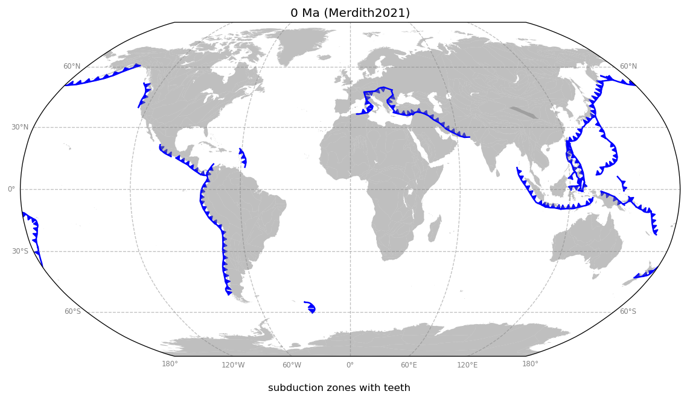
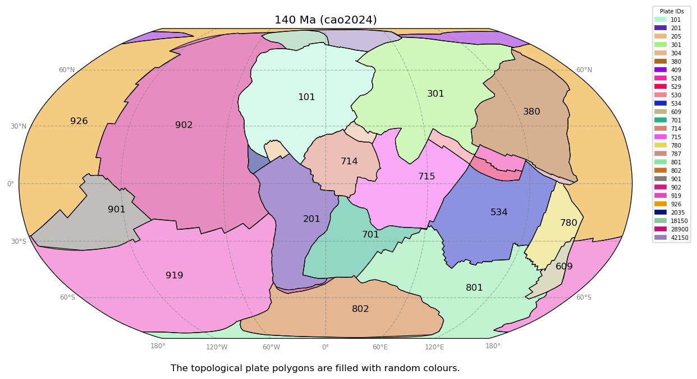

# GPlates Web Service Python Client/Proxy


[](https://badge.fury.io/py/gplates-ws-proxy)

This Python package allows users to access [GPlates Web Service](https://gwsdoc.gplates.org/) more easily via simple Python programming interface.

### Installation

`pip install gplates-ws-proxy`

### How to use

The following Python code reconstructs three locations to 100Ma with Muller2019 reconstruction model.

```python
  # pip install gplates-ws-proxy shapely
  import shapely
  from gplates_ws_proxy import PlateModel, reconstruct_shapely_points

  lats = [50, 10, 50]
  lons = [-100, 160, 100]
  points = [shapely.Point(x, y) for x, y in zip(lons, lats)]

  model = PlateModel("Muller2019")
  paleo_points = reconstruct_shapely_points(model, points, 100)
  print(paleo_points)
```

### GPlates Web Service server

By default, https://gws.gplates.org is used. You can use .env file to specify your service URL. Alternertively, you can `export GWS_URL=https://your-service-url` in a terminal.

See [env.template](src/gplates_ws_proxy/env.template) and [setup GWS server with Docker](https://github.com/GPlates/gplates-web-service/tree/master/docker#-quick-start).

### Dependencies

- [requests](https://pypi.org/project/requests/)
- [shapely](https://pypi.org/project/shapely/)

### API reference

API reference can be found at https://michaelchin.github.io/gplates-python-proxy/.

### Examples

👉 [reconstruct_shapely_points.py](examples/reconstruct_shapely_points.py)

The red dots are present-day locations. The blue dots are paleo-locations at 100Ma.


👉 [plot_subduction_zones.py](examples/plot_subduction_zones.py)



👉 [plot_topological_plate_polygons.py](examples/plot_topological_plate_polygons.py)



[All Examples](examples/readme.md)
