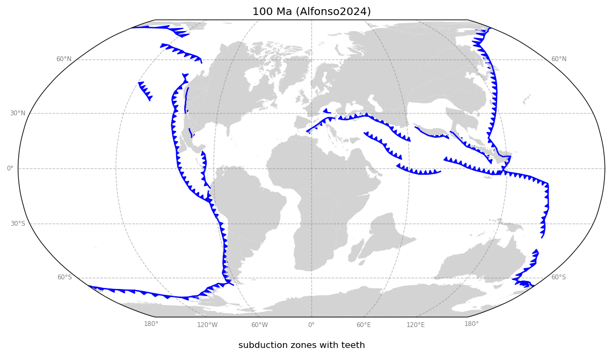
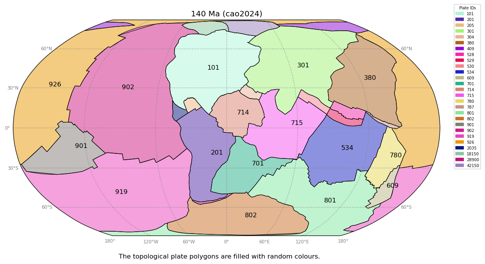
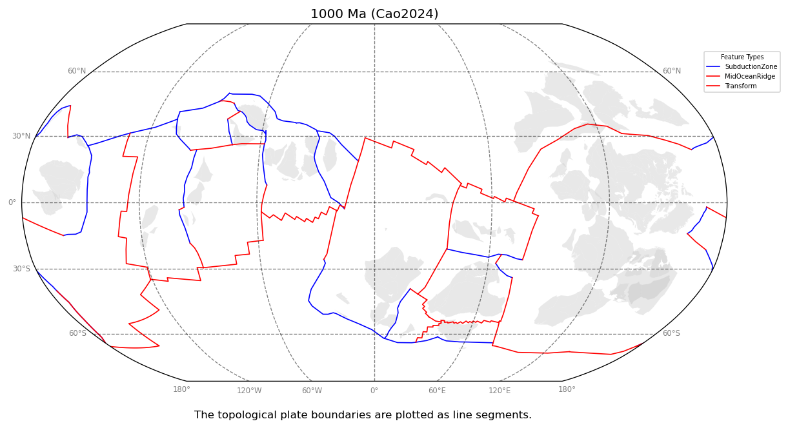
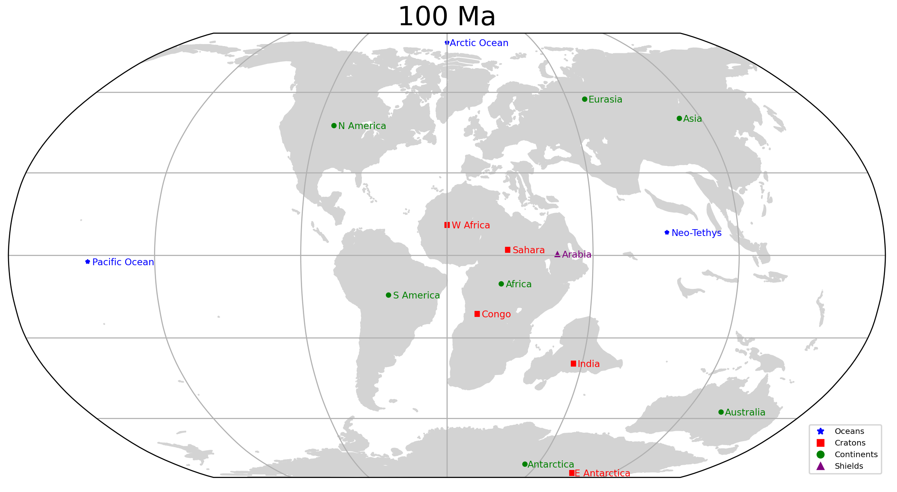

Use the following commands to create a running environment

```console
conda create --name gplates-ws-example -c conda-forge cartopy matplotlib moviepy shapely jupyter requests

conda activate gplates-ws-example

pip install gwspy
```

Alternatively, you may use the environment.yml to create the conda env.

```console
conda env create -f environment.yml

conda activate gplates-ws-example

pip install gwspy
```

Run the examples

```console

conda run -n gplates-ws-example ./reconstruct_shapely_points.py

```

### Reconstruct locations

👉 [reconstruct_shapely_points.py](reconstruct_shapely_points.py)

The red dots are present-day locations. The blue dots are paleo-locations at 100Ma.


### Plot subduction zones

👉 [plot_subduction_zones.py](plot_subduction_zones.py)



### Plot topological plate polygons

👉 [plot_topological_plate_polygons.py](plot_topological_plate_polygons.py)



### Plot paleo-coastlines

👉 [plot_paleo_coastlines.py](plot_paleo_coastlines.py)


### Plot topological features

👉[plot_topological_features.py](plot_topological_features.py)


### Plot topological plate boundaries

👉[plot_topological_plate_boundaries.py](plot_topological_plate_boundaries.py)



### Plot paleo-labels

👉 [plot_paleo_labels.py](plot_paleo_labels.py)



### Paleo-coastlines movie

👉 [make_paleo_coastlines_movie.py](make_paleo_coastlines_movie.py)


